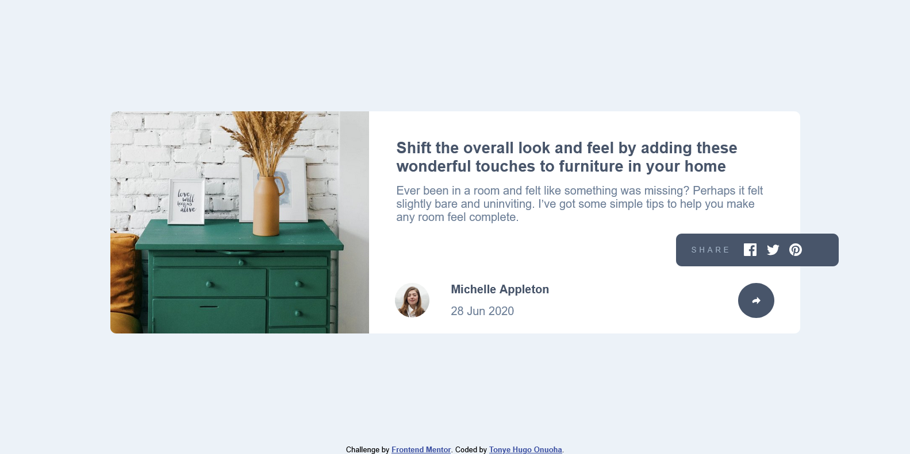

# Frontend Mentor - Article preview component solution

This is a solution to the
[Article preview component challenge on Frontend Mentor](https://www.frontendmentor.io/challenges/article-preview-component-dYBN_pYFT).
Frontend Mentor challenges help you improve your coding skills by building realistic projects.

## Table of contents

- [Overview](#overview)
  - [Screenshot](#screenshot)
  - [Links](#links)
- [My process](#my-process)
  - [Built with](#built-with)
  - [Useful resources](#useful-resources)
- [Author](#author)

## Overview

This is a simple HTML and CSS project in which the main objective is to build out an "Article preview component" web
page.

### Screenshot

### Links

- Live Site URL: [Vercel]()

## My process

The process was very straightforward. I started by writing out the stucture of my HTML. I then created a CSS stylesheet
and broke down the styling of elements one piece at a time using the flexbox layout model and the mobile-first approach.
Finally, I proceeded to write the media queries for the desktop design.

### Built with

- Semantic HTML5 markup
- CSS custom properties
- Flexbox layout model
- Media queries

### Useful resources

- [W3Schools](https://www.w3schools.com/)

## Author

- Email Address - [tonyeonuoha@gmail.com](tonyeonuoha@gmail.com)
